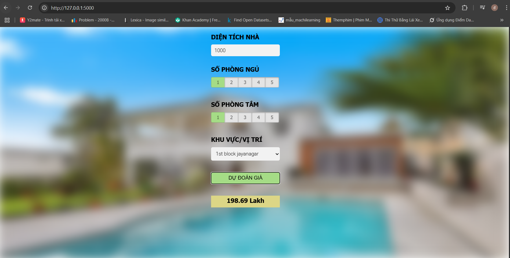
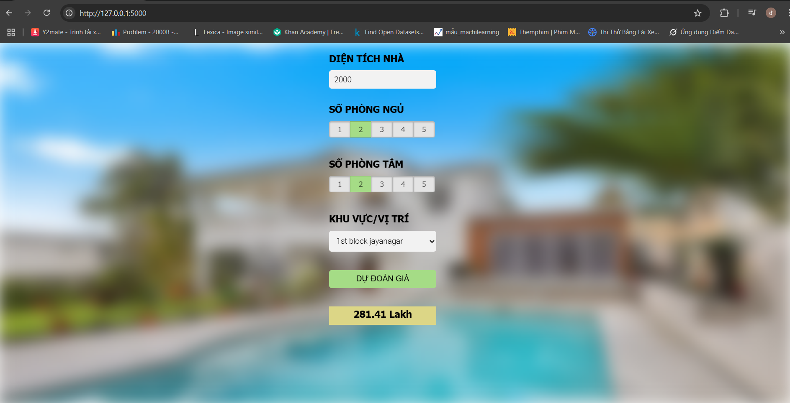
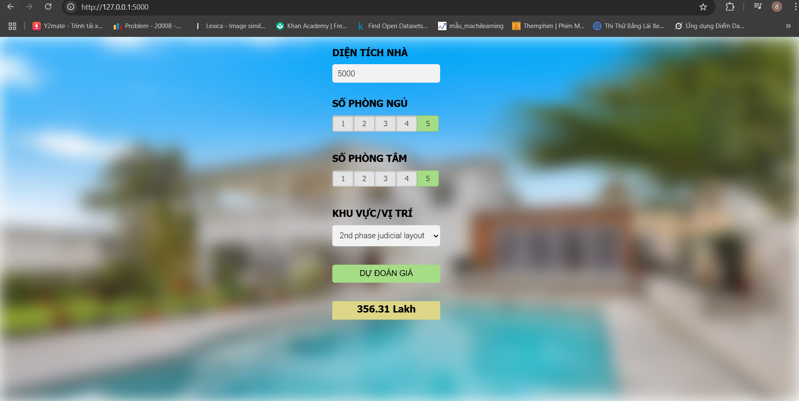

1. House bengaluru data fetch (Bengaluru_House_Data.csv) and preprocess
2. Machine Learning Model Training:
  * Using models:
      LinearRegression
      Lasso Regression
      DecisionTreeRegressor
  * Use GridSearchCV and ShuffleSplit to:
      Find the best model
      Evaluate accuracy via cross-validation
  * Save model:
      banglore_home_price_model.pickle
      columns.json (contains a list of column names – for future predictions)
3. Backend Flask and Frontend (html, css,js)

## Demo program
demo 1

demo 2

demo 3

